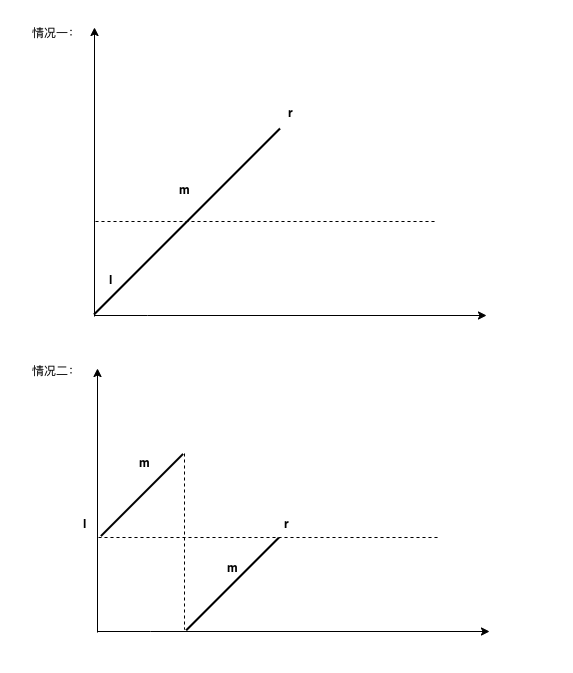

# [153.寻找旋转排序数组中的最小值](https://leetcode-cn.com/problems/find-minimum-in-rotated-sorted-array/)

## 题目描述

已知一个长度为 n 的数组，预先按照升序排列，经由 1 到 n 次 旋转 后，得到输入数组。例如，原数组 nums = [0,1,2,4,5,6,7] 在变化后可能得到：

- 若旋转 4 次，则可以得到 [4,5,6,7,0,1,2]  
- 若旋转 7 次，则可以得到 [0,1,2,4,5,6,7]

注意，数组 [a[0], a[1], a[2], ..., a[n-1]] 旋转一次 的结果为数组 [a[n-1], a[0], a[1], a[2], ..., a[n-2]] 。

给你一个元素值 互不相同 的数组 nums ，它原来是一个升序排列的数组，并按上述情形进行了多次旋转。请你找出并返回数组中的 最小元素。

示例 1：

```
输入：nums = [3,4,5,1,2]
输出：1
解释：原数组为 [1,2,3,4,5] ，旋转 3 次得到输入数组。
```

示例 2：

```
输入：nums = [4,5,6,7,0,1,2]
输出：0
解释：原数组为 [0,1,2,4,5,6,7] ，旋转 4 次得到输入数组。
```

示例 3：

```
输入：nums = [11,13,15,17]
输出：11
解释：原数组为 [11,13,15,17] ，旋转 4 次得到输入数组。
```

提示：

- n == nums.length
- 1 <= n <= 5000
- -5000 <= nums[i] <= 5000
- nums 中的所有整数 互不相同
- nums 原来是一个升序排序的数组，并进行了 1 至 n 次旋转

## 解法

### 思路解析

旋转后分两种情况处理，如下图所示：



### Golang 实现及其测试代码

```go
package main

import "fmt"

func findMinInRotateSortArray(nums []int) int {
	l, r := 0, len(nums) - 1
	if nums[l] < nums[r] {
		return nums[0]
	}
	for l < r {
		m := (l+r) >> 1  // 取中间, ==> (l+r)/2
		if nums[m] > nums[r] {
			l = m + 1
		} else {
			r = m
		}
	}
	return nums[l]
}

func main() {
	// [3,4,5,1,2]
	// [4,5,6,7,0,1,2]
	// [11,13,15,17]
	nums := []int{3,4,5,1,2}
	fmt.Println(findMinInRotateSortArray(nums))	// 1
}
```
