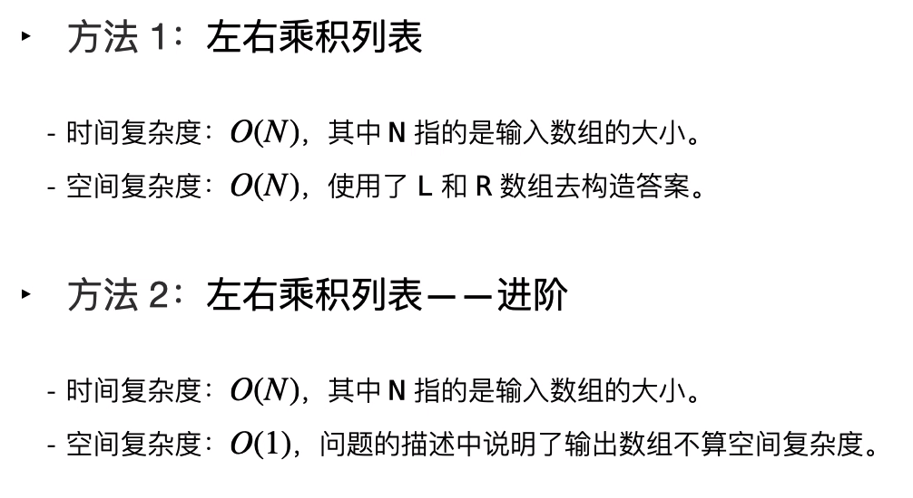
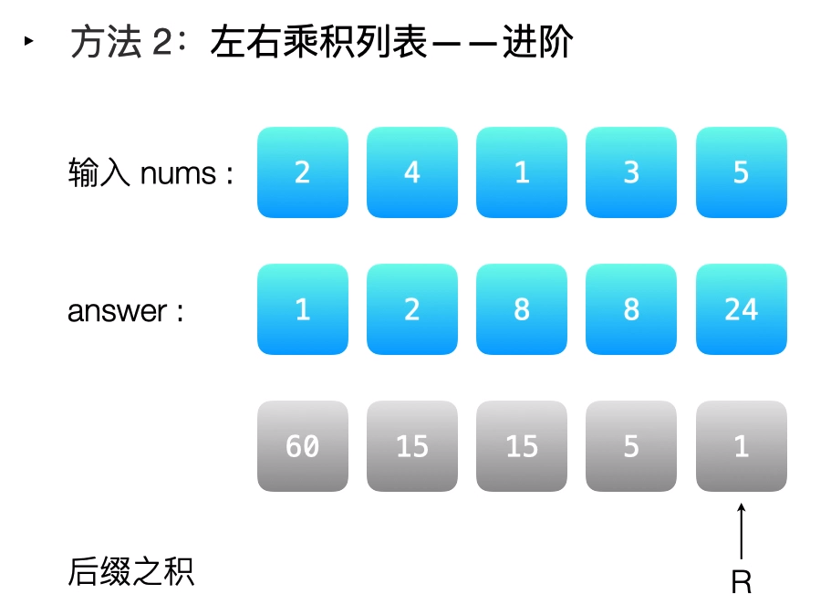

# [238.除自身以外数组的乘积](https://leetcode-cn.com/problems/product-of-array-except-self/)

## 题目描述

给你一个长度为 n 的整数数组 nums，其中 n > 1，返回输出数组 output ，其中 output[i] 等于 nums 中除 nums[i] 之外其余各元素的乘积。


示例 1：

```
输入: [1,2,3,4]
输出: [24,12,8,6]
```

示例 2：

```
输入：nums1 = [1], m = 1, nums2 = [], n = 0
输出：[1]
```

提示：题目数据保证数组之中任意元素的全部前缀元素和后缀（甚至是整个数组）的乘积都在 32 位整数范围内。

说明: 请不要使用除法，且在 O(n) 时间复杂度内完成此题。

进阶：你可以在常数空间复杂度内完成这个题目吗？（ 出于对空间复杂度分析的目的，输出数组不被视为额外空间。）

## 解法

### 思路解析

前缀之积 * 后缀之积，如下所示：






### Golang 实现及其测试代码

```go
package main

import "fmt"

func productExceptSelf(nums []int) []int {
	n := len(nums)
	output := make([]int, n)
	l, r := 1, 1
	
	for i := 0; i < n; i++ {
		output[i] = l
		l *= nums[i]
	}
	for i := n-1; i >= 0; i-- {
		output[i] *= r
		r *= nums[i]
	}

	return output
}

func main() {
	nums := []int{1,2,3,4}
	fmt.Println(productExceptSelf(nums))
}
```
