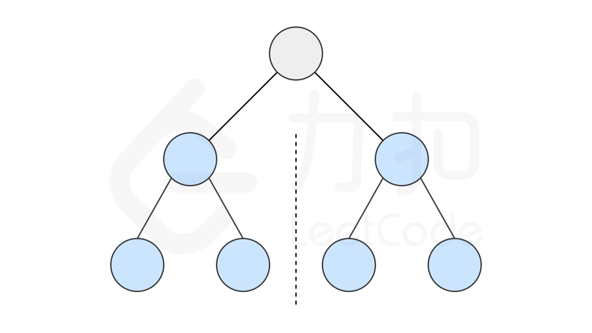
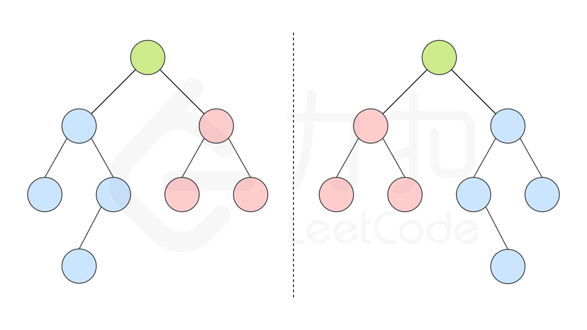

# [101.对称二叉树](https://leetcode-cn.com/problems/symmetric-tree/)

## 题目描述

给定一个二叉树，检查它是否是镜像对称的。

例如，二叉树 [1,2,2,3,4,4,3] 是对称的。

```
    1
   / \
  2   2
 / \ / \
3  4 4  3
```

但是下面这个 [1,2,2,null,3,null,3] 则不是镜像对称的:

```
    1
   / \
  2   2
   \   \
   3    3
```

## 解法

思路和算法

如果一个树的左子树与右子树镜像对称，那么这个树是对称的。



因此，该问题可以转化为：两个树在什么情况下互为镜像？

如果同时满足下面的条件，两个树互为镜像：

- 它们的两个根结点具有相同的值
- 每个树的右子树都与另一个树的左子树镜像对称



我们可以实现这样一个递归函数，通过「同步移动」两个指针的方法来遍历这棵树，pp 指针和 qq 指针一开始都指向这棵树的根，随后 pp 右移时，qq 左移，pp 左移时，qq 右移。每次检查当前 pp 和 qq 节点的值是否相等，如果相等再判断左右子树是否对称。

### Golang 实现及其测试代码

```go
import (
	. "GitCode/leetcode/solution/binary/comm"
)

func isSymmetric(root *TreeNode) bool {
    var checkFunc func(*TreeNode, *TreeNode) bool
	checkFunc = func(p, q *TreeNode) bool {
		if p == nil && q == nil {
			return true
		}
		if p == nil || q == nil {
			return false
		}
		return p.Val == q.Val && checkFunc(p.Left, q.Right) && checkFunc(p.Right, q.Left)
	}
	return checkFunc(root, root)
}
```
