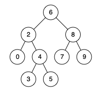

# [235.二叉搜索树的最近公共祖先](https://leetcode-cn.com/problems/lowest-common-ancestor-of-a-binary-search-tree)

## 题目描述

给定一个二叉搜索树, 找到该树中两个指定节点的最近公共祖先。

百度百科中最近公共祖先的定义为：“对于有根树 T 的两个结点 p、q，最近公共祖先表示为一个结点 x，满足 x 是 p、q 的祖先且 x 的深度尽可能大（一个节点也可以是它自己的祖先）。”

例如，给定如下二叉搜索树:  root = [6,2,8,0,4,7,9,null,null,3,5]



示例 1：

```
输入: root = [6,2,8,0,4,7,9,null,null,3,5], p = 2, q = 8
输出: 6 
解释: 节点 2 和节点 8 的最近公共祖先是 6。
```

示例 2：

```
输入: root = [6,2,8,0,4,7,9,null,null,3,5], p = 2, q = 4
输出: 2
解释: 节点 2 和节点 4 的最近公共祖先是 2, 因为根据定义最近公共祖先节点可以为节点本身。
```

说明：

- 所有节点的值都是唯一的。
- p、q 为不同节点且均存在于给定的二叉搜索树中。

进阶：递归算法很简单，试着通过迭代算法完成。

## 解法

### 思路与算法

在方法一中，我们对从根节点开始，通过遍历找出到达节点 p 和 q 的路径，一共需要两次遍历。我们也可以考虑将这两个节点放在一起遍历。

整体的遍历过程与方法一中的类似：

我们从根节点开始遍历；

如果当前节点的值大于 p 和 q 的值，说明 p 和 q 应该在当前节点的左子树，因此将当前节点移动到它的左子节点；

如果当前节点的值小于 p 和 q 的值，说明 p 和 q 应该在当前节点的右子树，因此将当前节点移动到它的右子节点；

如果当前节点的值不满足上述两条要求，那么说明当前节点就是「分岔点」。此时，p 和 q 要么在当前节点的不同的子树中，要么其中一个就是当前节点。

### 复杂度分析

时间复杂度：O(n)，其中 n 是给定的二叉搜索树中的节点个数。分析思路与方法一相同。

空间复杂度：O(1)。

### Golang 实现及其测试代码

```go
func lowestCommAncestor(root, p, q *TreeNode) *TreeNode {
	// 如果 p、q 的值都小于 root，说明 p、q 肯定在 root 的左子树中；
	// 如果 p、q 都大于 root，说明肯定在 root 的右子树中；
	// 如果一个在左一个在右，则说明此时的 root 记为对应的最近公共祖先。
	for {
		if root.Val > p.Val && root.Val > q.Val {
			root = root.Left
		} else if root.Val < p.Val && root.Val < q.Val {
			root = root.Right
		} else {
			return root
		}
	}
}
```
