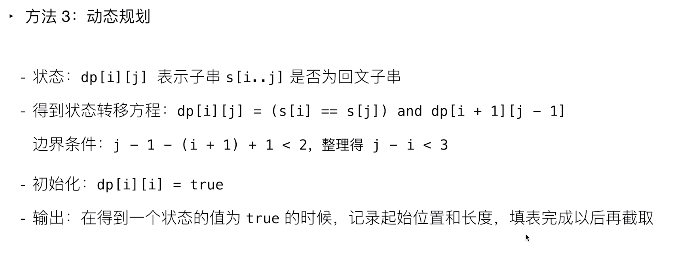
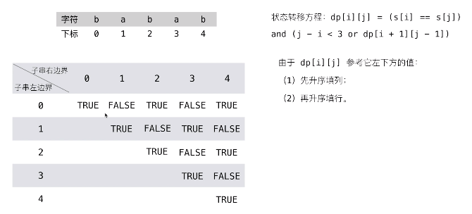

# [5.最长回文串](https://leetcode-cn.com/problems/longest-palindromic-substring/)

## 题目描述

给你一个字符串 s，找到 s 中最长的回文子串。

示例 1：

```
输入：s = "babad"
输出："bab"
解释："aba" 同样是符合题意的答案。
```

示例 2：

```
输入：s = "cbbd"
输出："bb"
```

示例 3：

```
输入：s = "a"
输出："a"
```

示例 4：

```
输入：s = "ac"
输出："a"
```

## 解法





## Golang 实现及其测试代码

```go
package main

import "fmt"

func longestPalindrome(s string) string {
    n := len(s)
    if n < 2 {
        return s
    }

    maxLen := 1
    begin := 0

    // dp[i][j] 表示 s[i..j] 是否是回文串
    dp := makeSlice2(n)
    for i := 0; i < n; i++ {
        // 初始化：所有长度为 1 的子串都是回文串
        dp[i][i] = true
    }
    
    // 递推开始
    // 先枚举子串长度
    for j := 0; j < n; j++ {
        // 枚举左边界，左边界的上限设置可以宽松一些
        for i := 0; i < j; i++ {
            if s[i] != s[j] {
                dp[i][j] = false
            } else {
                if (j - i) < 3 {
                    dp[i][j] = true
                } else {
                    dp[i][j] = dp[i+1][j-1]
                }
            }

            // 只要 dp[i][j] = true, 就表示子串s[i..j]是回文，此时记录回文长度 和 起始位置
            if dp[i][j] && (j-i+1) > maxLen {
                maxLen = j-i+1
                begin = i
            }
        }
    }
    return s[begin:begin+maxLen]
}

func makeSlice2(n int) [][]bool {
    slice := make([][]bool, n)
    for i := 0; i < n; i++ {
        slice[i] = make([]bool, n)
    }
    return slice
}

func main() {
	s := "cbbd"
    fmt.Println(longestPalindrome(s))
}
```
