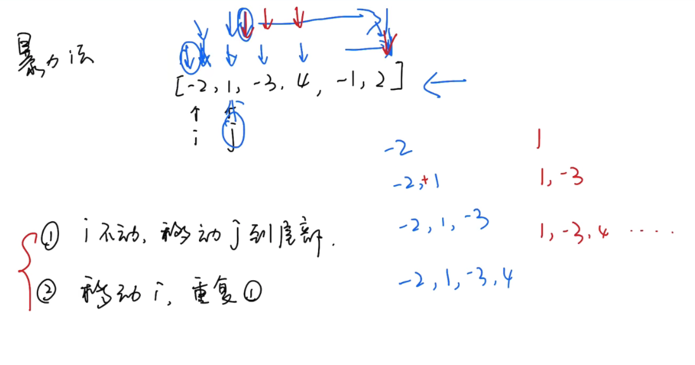
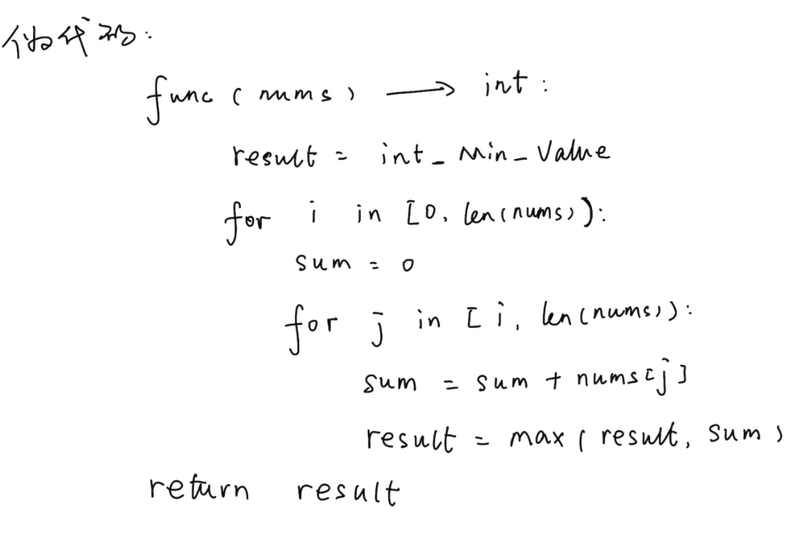
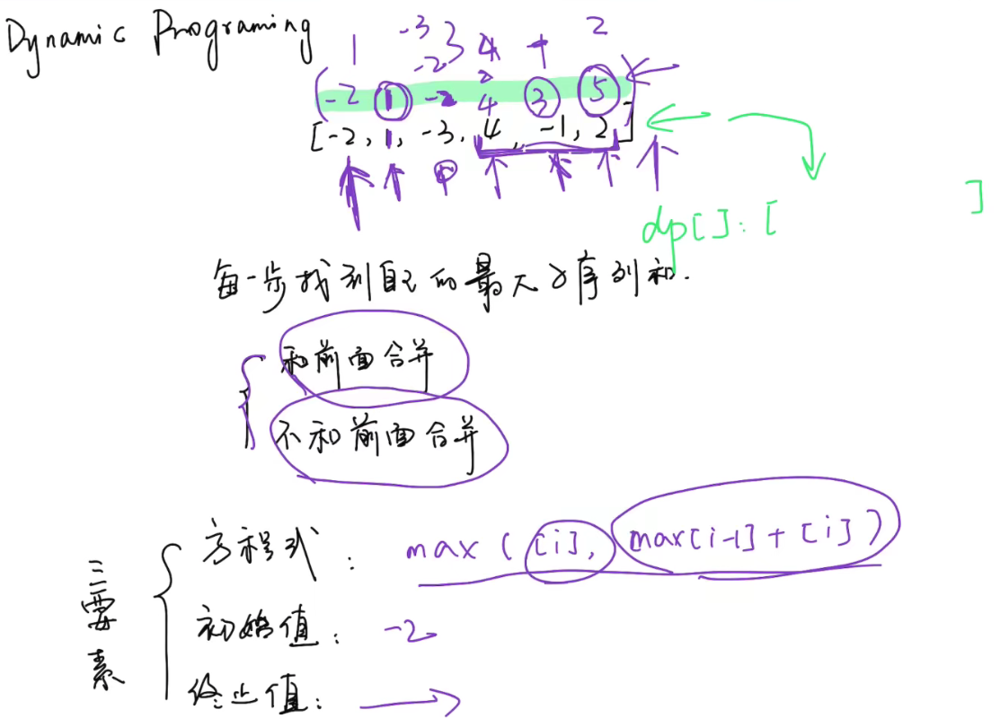
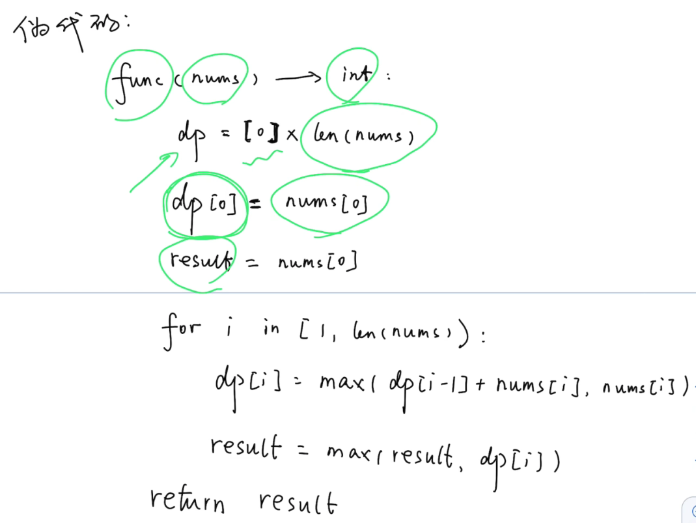

# [53.最大子序和](https://leetcode-cn.com/problems/longest-palindromic-substring/)

## 题目描述

给定一个整数数组 nums ，找到一个具有最大和的连续子数组（子数组最少包含一个元素），返回其最大和。

示例 1：

```
输入：nums = [-2,1,-3,4,-1,2,1,-5,4]
输出：6
解释：连续子数组 [4,-1,2,1] 的和最大，为 6 。
```

示例 2：

```
输入：nums = [1]
输出：1
```

示例 3：

```
输入：nums = [0]
输出：0
```

示例 4：

```
输入：nums = [-100000]
输出：-100000
```

## 解法

### 解法一：暴力法（思路和伪代码）





### 解法二：动态规划（思路和伪代码）





## Golang 实现及其测试代码

```go
package main

import "fmt"

// 解法一：暴力法（不推荐）
func maxSubArray(nums []int) int {
    result := -100000

    for i := 0; i < len(nums); i++ {
        sum := 0
        for j := i; j < len(nums); j++ {
            sum += nums[j]
            result = maxNum(result, sum)
        }
    }
    return result
}

func maxNum(a, b int) int {
    if a > b {
        return a
    }
    return b
}

// 解法二：动态规划
func maxSubArray2(nums []int) int {
    n := len(nums)
    dp := make([]int, n)
    dp[0] = nums[0]
    result := nums[0]
    for i := 1; i < n; i++ {
        dp[i] = maxNum(dp[i-1]+nums[i], nums[i])
        result = maxNum(result, dp[i])
    }
    return result
}

func main() {
	nums := []int{-2,1,-3,4,-1,2,1,-5,4}
    fmt.Println(maxSubArray(nums))
    fmt.Println(maxSubArray2(nums))
}
```
