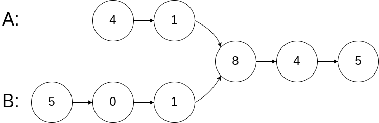
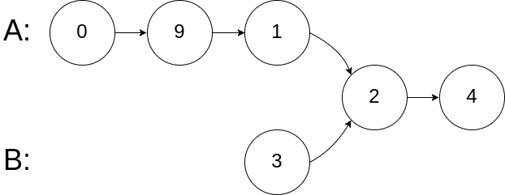
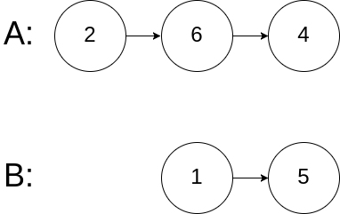

# [相交链表](https://leetcode-cn.com/problems/intersection-of-two-linked-lists)

## 题目描述

给你两个单链表的头节点 headA 和 headB ，请你找出并返回两个单链表相交的起始节点。如果两个链表没有交点，返回 null。

如下面两个链表


示例 1：



```
输入：intersectVal = 8, listA = [4,1,8,4,5], listB = [5,0,1,8,4,5], skipA = 2, skipB = 3
输出：Reference of the node with value = 8
输入解释：相交节点的值为 8 （注意，如果两个链表相交则不能为 0）。从各自的表头开始算起，链表 A 为 [4,1,8,4,5]，链表 B 为 [5,0,1,8,4,5]。在 A 中，相交节点前有 2 个节点；在 B 中，相交节点前有 3 个节点。
```

示例 2：



```
输入：intersectVal = 2, listA = [0,9,1,2,4], listB = [3,2,4], skipA = 3, skipB = 1
输出：Reference of the node with value = 2
输入解释：相交节点的值为 2 （注意，如果两个链表相交则不能为 0）。从各自的表头开始算起，链表 A 为 [0,9,1,2,4]，链表 B 为 [3,2,4]。在 A 中，相交节点前有 3 个节点；在 B 中，相交节点前有 1 个节点。
```

示例 3：



```
输入：intersectVal = 0, listA = [2,6,4], listB = [1,5], skipA = 3, skipB = 2
输出：null
输入解释：从各自的表头开始算起，链表 A 为 [2,6,4]，链表 B 为 [1,5]。由于这两个链表不相交，所以 intersectVal 必须为 0，而 skipA 和 skipB 可以是任意值。
解释：这两个链表不相交，因此返回 null。
```

注意：

- 如果两个链表没有交点，返回 null.
- 在返回结果后，两个链表仍须保持原有的结构。
- 可假定整个链表结构中没有循环。
- 程序尽量满足 O(n) 时间复杂度，且仅用 O(1) 内存。

## 解法

### 方法一：哈希集合

#### 思路和算法

判断两个链表是否相交，可以使用哈希集合存储链表节点。

首先遍历链表 headA，并将链表 headA 中的每个节点加入哈希集合中。然后遍历链表 headB，对于遍历到的每个节点，判断该节点是否在哈希集合中：

- 如果当前节点不在哈希集合中，则继续遍历下一个节点；

- 如果当前节点在哈希集合中，则后面的节点都在哈希集合中，即从当前节点开始的所有节点都在两个链表的相交部分，因此在链表 headB 中遍历到的第一个在哈希集合中的节点就是两个链表相交的节点，返回该节点。

- 如果链表 headB 中的所有节点都不在哈希集合中，则两个链表不相交，返回 null。

#### Golang 代码实现

```go
func getIntersectionNode(headA, headB *ListNode) *ListNode {
     vis := map[*ListNode]bool{}
     for tmp := headA; tmp != nil; tmp = tmp.Next {
         vis[tmp] = true
     }
     for tmp := headB; tmp != nil; tmp = tmp.Next {
         if vis[tmp] {
             return tm其测试代码p
         }
     }
     return nil
 }
```

#### 复杂度分析

- 时间复杂度：O(m+n)，其中 m 和 n 是分别是链表 headA 和 headB 的长度。需要遍历两个链表各一次。

空间复杂度：O(m)，其中 m 是链表 headA 的长度。需要使用哈希集合存储链表 headA 中的全部节点。

### 方法二：双指针

#### 思路和算法

使用双指针的方法，可以将空间复杂度降至 O(1)。

只有当链表 headA 和 headB 都不为空时，两个链表才可能相交。因此首先判断链表 headA 和 headB 是否为空，如果其中至少有一个链表为空，则两个链表一定不相交，返回 null。

当链表 headA 和 headB 都不为空时，创建两个指针 pA 和 pB，初始时分别指向两个链表的头节点 headA 和 headB，然后将两个指针依次遍历两个链表的每个节点。具体做法如下：

- 每步操作需要同时更新指针 pA 和 pB；

- 如果指针 pA 不为空，则将指针 pA 移到下一个节点；如果指针 pB 不为空，则将指针 pB 移到下一个节点。

- 如果指针 pA 为空，则将指针 pA 移到链表 headB 的头节点；如果指针 pB 为空，则将指针 pB 移到链表 headA 的头节点。

- 当指针 pA 和 pB 指向同一个节点或者都为空时，返回它们指向的节点或者 null。


#### Golang 代码实现

```
func GetIntersectionNode(headA *Node, headB *Node) *Node {
	if headA == nil || headB == nil {
		return nil
	}
	pa, pb := headA, headB
	for pa != pb {
		if pa == nil {
			pa = headB
		} else {
			pa = pa.Next
		}
		if pb == nil {
			pb = headA
		} else {
			pb = pb.Next
		}
	}
	return pa
}
```

#### 复杂度分析

- 时间复杂度：O(m+n)O(m+n)，其中 mm 和 nn 是分别是链表 \textit{headA}headA 和 \textit{headB}headB 的长度。两个指针同时遍历两个链表，每个指针遍历两个链表各一次。

- 空间复杂度：O(1)O(1)。
