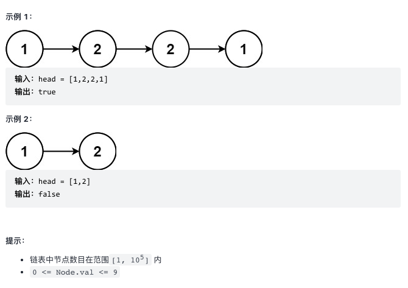

# [234.回文链表](https://leetcode-cn.com/problems/palindrome-linked-list/)

## 题目描述

给你一个单链表的头节点 head ，请你判断该链表是否为回文链表。如果是，返回 true ；否则，返回 false 。

示例如下所示：



## 解法

一共为两个步骤：

1. 复制链表值到数组列表中。
2. 使用双指针法判断是否为回文。

## Golang 实现

```go

type Node struct {
    Val int
    Next *Node
}

func isPalindrome(head *Node) bool {
	valSlice := []int{}
	for head != nil {
		valSlice = append(valSlice, head.Data)
		head = head.Next
	}
	n := len(valSlice)
	for i, val := range valSlice[:n/2] {
		if val != valSlice[n-1-i] {
			return false
		}
	}
	return true
}
```
