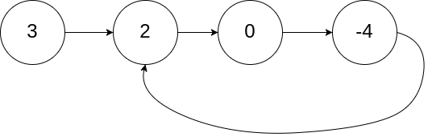
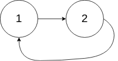

# [141.环形链表](https://leetcode-cn.com/problems/linked-list-cycle)

## 题目描述

给定一个链表，判断链表中是否有环。

如果链表中有某个节点，可以通过连续跟踪 next 指针再次到达，则链表中存在环。 为了表示给定链表中的环，我们使用整数 pos 来表示链表尾连接到链表中的位置（索引从 0 开始）。 如果 pos 是 -1，则在该链表中没有环。注意：pos 不作为参数进行传递，仅仅是为了标识链表的实际情况。

如果链表中存在环，则返回 true 。 否则，返回 false 。

进阶：

你能用 O(1)（即，常量）内存解决此问题吗？

示例 1：



```
输入：head = [3,2,0,-4], pos = 1
输出：true
解释：链表中有一个环，其尾部连接到第二个节点。
```

示例 2：



```
输入：head = [1,2], pos = 0
输出：true
解释：链表中有一个环，其尾部连接到第一个节点。
```

示例 3：


```
输入：head = [1], pos = -1
输出：false
解释：链表中没有环。
```

提示：

- 链表中节点的数目范围在范围 [0, 104] 内
- -105 <= Node.val <= 105
- pos 的值为 -1 或者链表中的一个有效索引

## 解法

定义快慢指针 slow、fast，初始指向 head。

快指针每次走两步，慢指针每次走一步，不断循环。当相遇时，说明链表存在环。如果循环结束依然没有相遇，说明链表不存在环。

## Golang

```go
package main

import (
	. "GitCode/leetcode/solution/link/comm"
	"fmt"
)

func LinkHasCycle(head *Node) bool {
	if head == nil || head.Next == nil {
		return false
	}

	slow, fast := head, head.Next
	for {
		if fast == nil || fast.Next == nil {
			return  false
		}
		if slow == fast {
			return true
		}
		slow, fast = slow.Next, fast.Next.Next
	}
}

func main() {
	// 创建单向链表实例
	link := CreateLinkList()

	// 测试 在头节点添加元素
	link.Append(23)
	link.Append(22)
	link.Append(21)

	hasCycle := LinkHasCycle(link.Header)
	fmt.Println(hasCycle)	// false

}
```
