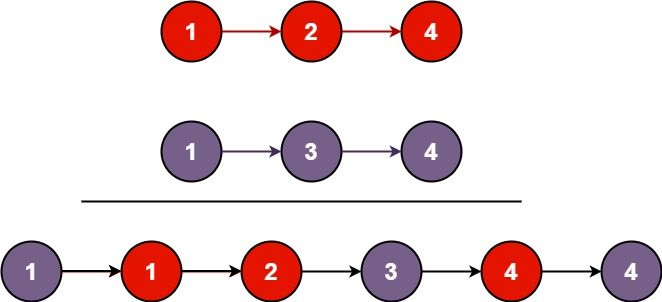

# [21.合并两个有序链表](https://leetcode-cn.com/problems/merge-two-sorted-lists)

## 题目描述

将两个升序链表合并为一个新的 升序 链表并返回。新链表是通过拼接给定的两个链表的所有节点组成的。

示例 1：



```
输入：l1 = [1,2,4], l2 = [1,3,4]
输出：[1,1,2,3,4,4]
```

示例 2：
```
输入：l1 = [], l2 = []
输出：[]
```

示例 3：
```
输入：l1 = [], l2 = [0]
输出：[0]
```

提示：

- 两个链表的节点数目范围是 [0, 50]
- -100 <= Node.val <= 100
- l1 和 l2 均按 非递减顺序 排列

## 解法

迭代遍历两链表，比较节点值 val 的大小，进行节点串联，得到最终链表。

## Golang 实现及其测试代码

```go
package main

import (
	. "GitCode/leetcode/solution/link/comm"
)

func MergeTwoLists(l1 *Node, l2 *Node) *Node {
	head := &Node{}
	cur := head
	for l1 != nil && l2 != nil {
		if l1.Data < l2.Data {
			cur.Next = l1
			l1 = l1.Next
		} else {
			cur.Next = l2
			l2 = l2.Next
		}
		cur = cur.Next
	}
	if l1 != nil {
		cur.Next = l1
	} else if l2 != nil {
		cur.Next = l2
	}
	return head.Next
}

func main() {
	link := CreateLinkList()
	link.Append(1)
	link.Append(2)
	link.Append(4)

	link2 := CreateLinkList()
	link2.Append(1)
	link2.Append(3)
	link2.Append(4)

	mergeHeadNode := MergeTwoLists(link.Header, link2.Header)
	PrintNodeByHead(mergeHeadNode)
}
```
