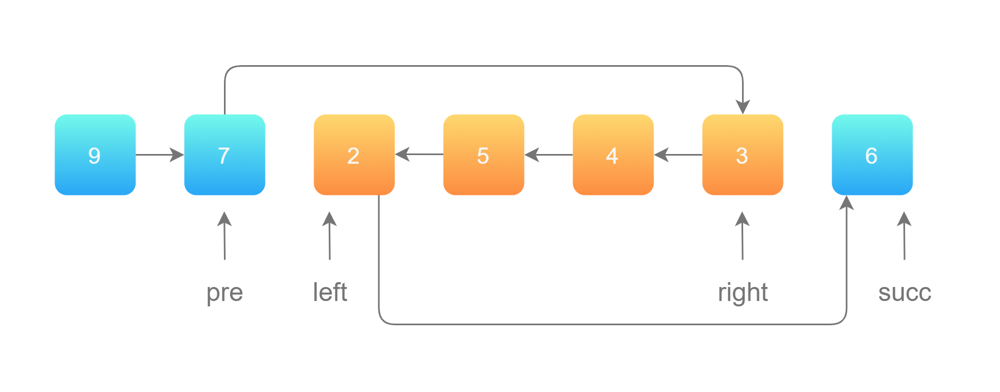

# [92.反转链表II](https://leetcode-cn.com/problems/reverse-linked-list-ii/)

## 题目描述

给你单链表的头指针 head 和两个整数 left 和 right ，其中 left <= right 。请你反转从位置 left 到位置 right 的链表节点，返回 反转后的链表 。

示例 1：


```
输入：head = [1,2,3,4,5], left = 2, right = 4
输出：[1,4,3,2,5]
```

示例 2：

```
输入：head = [5], left = 1, right = 1
输出：[5]
```

## 解题思路

第 1 步：先将待反转的区域反转；
第 2 步：把 pre 的 next 指针指向反转以后的链表头节点，把反转以后的链表的尾节点的 next 指针指向 succ。如下图所示：




## Golang

```go
package main

import (
	. "GitCode/leetcode/solution/link/comm"
)

func reverseLink(head *Node) {
	curr := head
	var pre *Node
	for curr != nil {
		curr, curr.Next, pre = curr.Next, pre, curr
	}
}

// 反转链表II
func reverseBetween(head *Node, left int, right int) *Node {
	dyNode := &Node{Data: -1}
	dyNode.Next = head

	pre := dyNode
	for i := 0; i < left - 1; i++ {
		pre = pre.Next
	}

	rNode := pre
	for i := 0; i < right - left + 1; i++ {
		rNode = rNode.Next
	}

	lNode := pre.Next
	curr := rNode.Next

	pre.Next = nil
	rNode.Next = nil

	reverseLink(lNode)

	pre.Next = rNode
	lNode.Next = curr

	return dyNode.Next
}

func main() {
	link := CreateLinkList()
	link.Append(1)
	link.Append(2)
	link.Append(3)
	link.Append(4)
	link.Append(5)

	node := reverseBetween(link.Header, 2, 4)
	PrintNodeByHead(node)	
}

```
