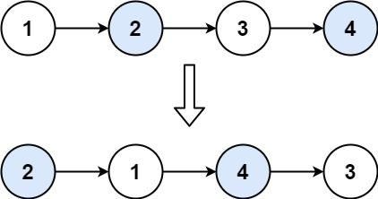

# [24.两两交换链表中的节点](https://leetcode-cn.com/problems/swap-nodes-in-pairs)

## 题目描述

给定一个链表，两两交换其中相邻的节点，并返回交换后的链表。

你不能只是单纯的改变节点内部的值，而是需要实际的进行节点交换。

示例 1：



```
输入：head = [1,2,3,4]
输出：[2,1,4,3]
```

示例 2：
```
输入：head = []
输出：[]
```

示例 3：
```
输入：head = [1]
输出：[1]
```

提示：

链表中节点的数目在范围 [0, 100] 内
0 <= Node.val <= 100

进阶：你能在不修改链表节点值的情况下解决这个问题吗?（也就是说，仅修改节点本身。）

## 解法

## Golang 实现及其测试代码

```go
package main
 
 import "fmt"
 
 
 func SwapPairs(head *Node) *Node {
 	dummy := &Node{}
 	pre := dummy
 	cur := head
 	for cur != nil && cur.Next != nil {
 		cur.Next, cur.Next.Next, pre.Next = cur.Next.Next, cur, cur.Next
 		pre = cur
 		cur = pre.Next
 	}
 	return dummy.Next
 }
 
 func main() {
 	// 创建单向链表实例
 	link := CreateLinkList()
 
 	// 测试 在头节点添加元素
 	link.AddInHead(24)
 	link.AddInHead(23)
 	link.AddInHead(22)
 	link.AddInHead(21)
 
 	// 遍历打印单向链表元素
 	link.ScanLinkList()
 
 	data := SwapPairs(link.Header)
 	printNodeByHead(data)
 }
```
